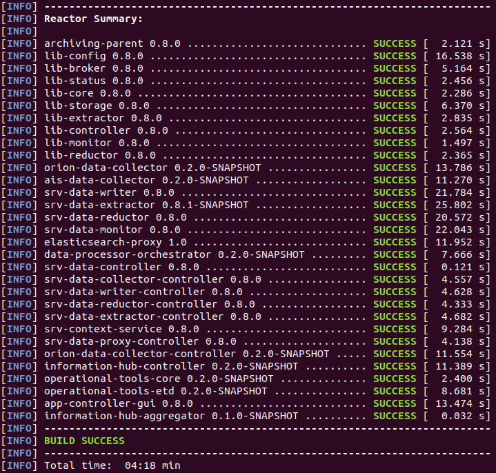

# Overview

The Information Hub is developed in Java technology and managed by the Maven tool. It is organized as a multi-module Maven project where each module is located in its own Git repository. The main repository is [information-hub-aggregator](https://gitpixel.satrdlab.upv.es/xlab/information-hub-aggregator) which contains a Maven aggregator POM file which specifies all modules of the project. In addition to this aggregator POM the project also contains a parent POM which defines common Maven configuration that is inherited by other modules. The parent POM file is located in the information-hub-parent repository. The information-hub-aggregator repository includes other repositories as Git submodules. A submodule is a Git repository nested inside a parent Git repository at a specific path in the parent repository's working directory. Submodules are configured in the `.gitmodules` file located in the root of the information-hub-aggregator repository.

The Information Hub is distributed as a set of Docker images and can be deployed using the Docker Compose tool. The [information-hub-docker](https://gitpixel.satrdlab.upv.es/xlab/information-hub-docker) repository provides Docker Compose projects for installing Information Hub together with Elasticsearch. The POM file contains Maven configuration for building Docker images during the package phase using Spotify Dockerfile Maven plugin.

The Information Hub Management Console is a Java desktop application and is distributed as a ZIP archive containing an executable JAR package with dependencies and a configuration file. The source code is located in app-controller-gui repository and is included in the information-hub-aggregator repository as apps/app-controller-gui module. The Management Console is developed with the JavaFX software platform. It can be built and run using Oracle JDK or OpenJDK; however, OpenJDK requires additional JavaFX libraries.

# Building from sources

Required tools:

-   Git
-   JDK 8 (OpenJDK or Oracle JDK can be used)
-   Maven 3
-   Docker

Clone the information-hub-aggregator repository:
```
git clone https://gitpixel.satrdlab.upv.es/xlab/information-hub-aggregator.git
```

Navigate to the information-hub-aggregator directory and initialize Git submodules of the project using following command:
```
git submodule init
```

Update the submodules by running:
```
git submodule update
```

This command will clone missing submodules and checkout the commit specified in the index of the containing repository. This will leave the submodule repositories in a detached HEAD state by default.

To display a list of all submodules, currently checked out commit for each submodule together with its status, run the 'git submodule status' command:


Build the project using following command:
```
mvn package
```

To speed up the build process you can use the `-Dmaven.test.skip=true` switch. When done, maven will print the build summary as depicted in the figure below:



The Maven builds all the modules into JAR archives and generates Docker images for all modules representing Information Hub services. To view the generated Docker images, run the `docker images` command:


# Development environment

The Information Hub can be run in the local development environment from the Java IDE. First clone and initialize the [information-hub-aggregator](https://gitpixel.satrdlab.upv.es/xlab/information-hub-aggregator) project as described in the previous section. The Information Hub requires following third-party software for running:

- Apache Zookeeper
- Apache Kafka
- Elasticsearch
- Orion Context Broker (if Orion Data Collector will be used)

The [information-hub-docker](https://gitpixel.satrdlab.upv.es/xlab/information-hub-docker) repository provides Docker Compose projects for deploying all the required software. Clone the repository, navigate into `kafka-zookeeper`, `elastic` and `orion-context-broker` directories and run following command to deploy corresponding services:
```
docker-compose up -d
```

Add following entries to the `/etc/hosts` file:

```
172.17.0.1 csco.archiving.broker
172.17.0.1 csco.archiving.config
172.17.0.1 csco.archiving.sts csco.archiving.lts
172.17.0.1 csco.archiving.controller
172.17.0.1 csco.archiving.monitor
```

`csco.archiving.broker` represents Apache Kafka hostname, `csco.archiving.config` represents Apache Zookeeper hostname and `csco.archiving.sts / lts` Elasticsearch. Adapt the IPs accordingly if you deployed these services to a different machine.

Orion Data Collector's configuration is located in the infhub.properties file inside orion-data-collector module:

```
orion.address=http://172.17.0.1:1026
orion.header.fiware-service=
orion.header.fiware-servicepath=
orion-collector.notification.callback.url=http://172.17.0.1:9009
orion-collector.notification.listener.port=9009
```

After finishing the configuration, you can start the Information Hub services and management console by running following Java classes from your IDE:

| Service | Main class |
| ------- | ---------- |
| information-hub-controller | si.xlab.pixel.infhub.controller.InfHubController |
| srv-data-monitor | de.gsi.cs.co.sv.archiving.monitor.MonitorService |
| orion-data-collector | si.xlab.pixel.infhub.collector.orion.OrionDataCollector |
| srv-data-writer | de.gsi.cs.co.sv.archiving.writer.Writer |
| srv-data-extractor | de.gsi.cs.co.sv.archiving.extractor.Extractor |
| app-controller-gui | de.gsi.cs.co.sv.archiving.gui.admin.ArchivingAdminApp |

# Potential extensions

The Information Hub is designed in a modular and scalable way and as generic as possible. This design allows it to be easily extended with new functionalities. Archiving System, the base of Information Hub which was developed by XLAB for the FAIR (Facility for Antiproton and Ion Research) particle accelerator facility in Darmstadt, Germany was extended for the needs of PIXEL project with following new components:

- Orion Data Collector: new type of the Data Collector component which collects data from data sources on Orion Context Broker.

- AIS Data Collector: new type of the Data Collector component which collects AIS data from AISHub sharing service.

- Data Processor: new type of component which can be plugged into the Information Hub platform and is used for on-the-fly (near real-time) data processing of incoming data streams. Specifically, this type of component was used for ETD (estimated time of departure) calculation on the VesselCall data records.

- Data Processor Orchestrator: new type of component which takes care for managing Data Processors and routing data streams through them by using Apache Kafka topics.

## Implementing Data Collector for a new data source

The Data Collector is a component responsible for obtaining data records from various devices and data sources, filtering and pre-processing data records and pushing them downstream through the Data Broker for further processing. Multiple types of Data Collector components can be used simultaneously to collect data from different data sources. In addition to the Data Collector component, the Data Collector Controller is also required which provides a REST API for controlling and managing Data Collector instances.

To develop a Data Collector for a new type of data source, you can take the Orion Data Collector project as a sample available in the [orion-data-collector](https://gitpixel.satrdlab.upv.es/xlab/orion-data-collector) repository. The corresponding Data Collector Controller project is available in the [orion-data-collector-controller](https://gitpixel.satrdlab.upv.es/xlab/orion-data-collector-controller) repository.

The OrionDataCollector class serves as a Collector's entry point. It gets the Collector's configuration file path provided as a command-line parameter and initializes an OrionCollectorContext instance using this path. The COMPONENT_NAME field is used as a service name for displaying in the Information Hub management console. Finally, the OrionDataCollector instantiates and runs OrionCollectorController which controls the operation of the collector.

The OrionCollectorContext object loads configuration properties from the provided configuration file and exposes them through getter methods. It creates an instance of StatusProducer which is used for reporting the Collector service status information to the Monitoring service which is displayed in the Information Hub management console.

The OrionConfigService serves for managing Collector service's configuration in Apache Zookeeper which is used as a centralized config storage. When Collector starts, it registers in the Zookeeper as depicted in the following figure:


All the configuration and management of the Collector goes via the Zookeeper. Collector sets a watch on the corresponding znode in ZooKeeper which triggers on any change. When the Collector Controller (API) updates the configuration in Zookeeper, the Collector gets a notification and takes an appropriate action, for example starts collecting new data source. This way scalability is achieved, and new Collector instances can be added dynamically.

The `OrionDataCollectorWorker` is responsible for collecting data from Orion Context Broker and managing subscriptions to data sources in Orion. When a new Orion data source is allocated to the Collector instance by the load balancer (through Zookeeper), the OrionDataCollectorWorker subscribes to notifications of data source events and creates a notifications handler. The notification handler accepts notification messages, extracts Orion entities and converts them to JSON objects containing a map of attribute name-value pairs in accordance with the source type schema.

Let's take as an example the TideSensorObserved source type. The schema of the source type as shown in Information Hub management console is depicted in the following figure:


Orion sends data entities in the following format as depicted in figure below:


The Collector converts this Orion entity from Orion format to the following JSON object containing map of attribute name-value pairs:


The Collector then converts the JSON object into a JSON string and creates an ArchiveRecord object:
```
ArchiveRecord archiveRecord = new ArchiveRecord(
        source.getSourceTypeId(),
        source.getSourceId(),
        System.currentTimeMillis());
archiveRecord.setRecordId(orionRecord.get("id").asText());
archiveRecord.setData(recordJson.getBytes());
```

The ArchiveRecord constructor has three parameters: source type ID, source ID and timestamp. The current time is used as the record timestamp in this case. The Orion entity ID is used as the record ID which makes possible to provide the updating records functionality. If a record with the same ID already exists in Elasticsearch, the existing record will be updated instead of a new one created. The content of archiveRecord is set using the setData method to the JSON object shown above converted to a byte array.

The ArchiveRecord is then pushed downstream through the Data Broker (Apache Kafka is used as a data broker). Each data source uses its own data publisher (IDataPublisher object) because sources might be routed to different Kafka topics according to the routing table which enables additional on-the-fly data processing in Data Processor components. The OrionDataCollectorWorker takes suitable publisher from the publishers' map and publishes the data record:
```
IDataPublisher publisher = this.publishers.get(source.getSourceId());
publisher.send(source, record);
```

## Implementing a new component

To support some custom functionality, it may be required to develop a new component type for the Information Hub. For example, a Data Processor component was developed to support on-the-fly data processing functionality.

Following the project structure, it is recommended for developing a new component:

### Main class

The main class (e.g. OrionDataCollector) provides an entry point to the application (main method) which is used for starting the service. The main class accepts configuration file path as a command-line parameter (if needed), initializes the component context and creates and starts the component\'s controller.

### Controller

The Controller class (e.g. OrionCollectorController) contains logic for controlling the instance life cycle. At start up, it connects to the configuration service (Zookeeper), retrieves the component configuration and initializes and starts the operation of the service. Afterwards it continues to monitor the values in the configuration service and applies any changes there to the local operation.

The controller class must extend ServiceController abstract class defined in lib-core library:
```
public abstract class ServiceController<T extends IServiceContext> {
    protected abstract void start(T context, InstanceData instanceConfig);
    protected abstract void stop(boolean maintenance);
    protected void applyInstanceConfig(InstanceData instanceConfig){
        // Override
    }
    protected void applyComponentConfig(ComponentData componentConfig){
        // Override
    }
}
```

The start method is called when the service is started. It provides an InstanceData object containing the instance configuration in Zookeeper. The stop method is called when the stop of the service has been triggered. The maintenance parameter reveals if the stop was triggered by the operator activating the maintenance mode. The applyInstanceConfig method is called when the component configuration in Zookeeper is changed and the method has to apply those changes to the service operation. The applyComponentConfig method is called when common Information Hub components configuration has been changed.

### Context

The Context class (e.g. OrionCollectorContext) contains all the runtime configuration of the currently running instance. It reads settings from the configuration file, environment variables and config service of the Information Hub. Furthermore, it creates an instance of StatusProducer for reporting service status information and provides this instance through getter method.

The Context class must extend ServiceContext class defined in lib-core library and may extend following methods to provide customized implementation:
```
InstanceConfigService getConfigService();
StatusProducer getStatusProducer();
InstanceData getDefaultInstanceConfiguration();
boolean doInit()
```

The getConfigService method returns an InstanceConfigService corresponding to the component for managing the component configuration in Zookeeper. The getStatusProducer method provides a StatusProducer instance. The getDefaultInstanceConfiguration method creates and returns an InstanceData (or appropriate child class) object containing default component configuration which is used when component is started for the first time to initialize the instance configuration node in Zookeeper. The doInit method can be overridden to load component specific configuration from configuration file or environment variables.

### InstanceConfigService

The InstanceConfigService instance (e.g. OrionConfigService) provides methods for retrieving and managing component's configuration in the Zookeeper as well as paths to the appropriate nodes in the ZooKeeper. To use standard znodes structure for generic Information Hub components, extend the ComponentConfigService class and provide suitable ID which will be used as a node name:
```
public class MyConfigService extends ComponentConfigService {
    private static String COMPONENT_ID = "MyComponent";
    public MyConfigService() {
        super(COMPONENT_ID);
    }
}
```

The figure below depicts structure of the Zookeeper node for Orion Data Collector component:


### Worker

The Worker class (e.g. OrionDataCollectorWorker) contains logic for the core operation of the component. It is instantiated and started by the Controller.

### Configuration file and Log4j configuration

Static configuration properties (which don't change in runtime) can be put into configuration properties file which is loaded at the component start up by the Context class.

The Information Hub uses Apache Log4j 2 logging framework. The log4j2.xml file contains the logging configuration.

### Dockerfile

The Dockerfile contains instructions for the Docker tool to build the Docker image of the component. The Information Hub is distributed as a set of Docker images; each component is packed into its own image. 'openjdk:8-jre-alpine' is used as a base image for Information Hub components. The figure below depicts Dockerfile for Orion Data Collector component:


