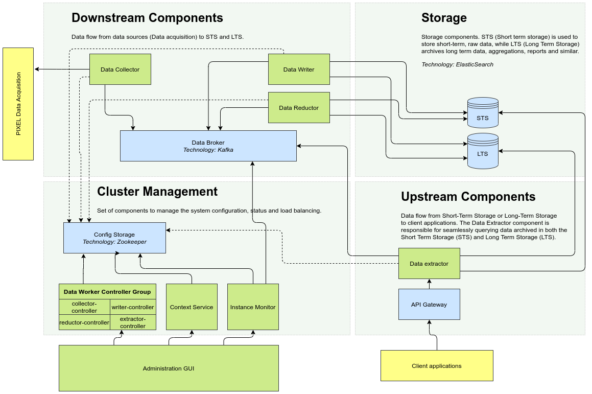

# Information Hub Documentation 

Information Hub is a functional block of the PIXEL platform in charge of centralising all the data retrieved from the DAL, homogenising and storing in a database capable to support big queries and scale horizontally. Unlike the DAL, the Information Hub is designed to be high performant and scalable, and the data is stored to support long-term queries. This is considered the central storage point of the IoT solution in PIXEL and is the block that replies the queries from other functional blocks (such as Operational Tools or Dashboards) and externals (API). The Information Hub’s main components are a high-performance data broker and a NoSQL database, although it contains accessory components that support its correct functioning.

The following diagram depicts the architecture of Information Hub:

Information Hub consists of several parts conceptually divided to components that push data toward the database (downstream), components involved in stored data retrieval and further processing (upstream) and components responsible for data persistence and storage. In addition the system provides supporting services for configuring, managing and monitoring the Information Hub and libraries contributing to greater extensibility and reusability. Below is a list of all services that form the Information Hub.

Components involved in the downstream flow:
* Data Collector
* Data Writer
* Data Broker
* Data Reductor
* Data Processor

Components involved in the upstream flow:
* Data Extractor
* Data Broker	

Storage components:
* Short-Term Storage
* Long-Term Storage
* Configuration Service

Supporting components:
* Context Service
* Instance Monitor
* Data Collector Controller
* Data Writer Controller
* Data Processor Controller
* Data Reductor Controller
* Data Extractor Controller
* Management Console

Controller components form the Data Worker Controller Group. Together with Context Service and Instance Monitor they provide REST and SSE endpoints for configuring and monitoring the Information Hub, e.g. from another network, without imposing dependencies on core components. This is accomplished by an agreement that all interactions between core components and other parts of the system must be realized through the Configuration Service.

Multiple supporting components belonging to the Data Worker Controller Group are used for configuring the Information Hub at different stages by accessing and modifying data in the Configuration Service. Client applications communicate with controller components using a HTTP REST protocol and server sent notifications, both implemented on top of the Jersey framework. To reduce code duplication and provide common ways of accessing controller APIs, the Controller Library has been developed as a thin client library, containing REST API resource definitions and helper methods encapsulating Jersey framework specifics. Context Service has been developed for a similar purpose but is not restricted to controlling only one specific core component. Therefore it provides REST endpoints for configuring Sources and Source Types, regulates system maintenance and other common operations.

The Information Hub has a built in mechanism for monitoring hardware utilization and data flow in different stages of the Information Hub data pipeline.  Similarly to controllers, the Instance Monitor provides REST and SSE endpoints. In comparison to controllers it also depends on long term storage, for retrieving the aforementioned metrics and for persisting non-configuration related data. Utilization and data flow metrics are retrieved in form of status event records and analysed based on pre-programmed conditions to produce system notification.