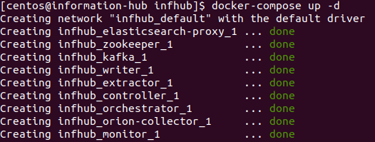
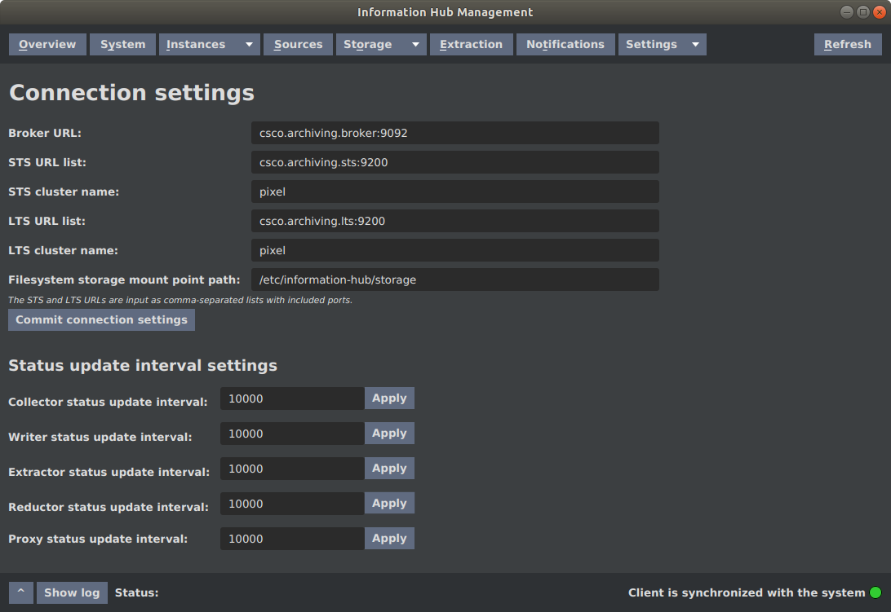
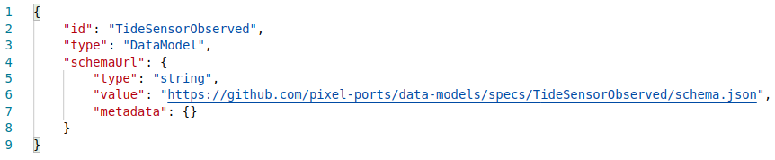

# Installation and Deployment

Information Hub is distributed as a set of Docker images and can be deployed using Docker Compose tool. The [information-hub-docker](https://gitpixel.satrdlab.upv.es/xlab/information-hub-docker) repository provides Docker Compose projects for installing Information Hub and Elasticsearch. The installation is split into two parts (two Docker Compose projects) - Information Hub and Elasticsearch which are located in the `infhub` and `elastic` folder respectively. The `infhub` Docker Compose project installs Information Hub together with its prerequisites Apache Kafka and ZooKeeper. The `elastic` Docker Compose project installs Elasticsearch and Kibana version 7.2.0. Alternatively, a custom installation of Elasticsearch can be used (taking into account that the supported version of Elasticsearch is 7.2.x). All services of Information Hub are installed to the single machine and likewise Elastic services are installed to a single machine which can be the same or different than for Information Hub. The structure of the `information-hub-docker` repository is depicted below:


The Information Hub Docker Compose project also includes an AIS Data Collector service which collects AIS data from [AISHub](https://www.aishub.net/) data sharing service. The installation of this service is optional and requires an AISHub membership.

The Docker Compose deployment of Information Hub consists of the following services:

| Service | Docker Image |
|---------|--------------|
| Apache ZooKeeper | wurstmeister/zookeeper |
| Apache Kafka | wurstmeister/kafka |
| Orion Data Collector | docker.pixel-ports.eu/information-hub/orion-data-collector |
| Controller | docker.pixel-ports.eu/information-hub/information-hub-controller |
| Data Writer | docker.pixel-ports.eu/information-hub/srv-data-writer |
| Data Monitor | docker.pixel-ports.eu/information-hub/srv-data-monitor |
| Data Extractor | docker.pixel-ports.eu/information-hub/srv-data-extractor |
| Elasticsearch Proxy | docker.pixel-ports.eu/information-hub/elasticsearch-proxy |
| AIS Data Collector (optional) | docker.pixel-ports.eu/information-hub/ais-data-collector |

Additionally, the provided Docker Compose deployment of Elasticsearch & Kibana consists of the following services:

| Service | Docker Image |
|---------|--------------|
| Elasticsearch | docker.elastic.co/elasticsearch/elasticsearch:7.2.0 |
| Kibana | docker.elastic.co/kibana/kibana:7.2.0 |

## Requirements

Requirements for the Information Hub installation are:

- Docker
- Docker Compose
- Orion Context Broker (if Orion Data Collector will be used)

The Information Hub installation has been tested on Ubuntu Linux 18.04 LTS and CentOS Linux 7.2 with Elasticsearch version 7.2.0.

## Installing Elasticsearch

Clone or download the [information-hub-docker](https://gitpixel.satrdlab.upv.es/xlab/information-hub-docker) repository to your Linux server then go into the `elastic` folder inside the repository. The provided Docker Compose file will deploy Elasticsearch and Kibana version 7.2.0. Elasticsearch can be installed on the same or different machine than Information Hub.

### Prerequisites

The default operating system limits on virtual memory (`mmap counts`) is likely to be too low for Elasticsearch, which may result in out of memory exceptions. See [Elasticsearch documentation](https://www.elastic.co/guide/en/elasticsearch/reference/current/vm-max-map-count.html) for details.

To check `vm.max_map_count` value, run:
```
sysctl vm.max_map_count
```

In case the `vm.max_map_count` value is too low (recommended value is 262144), you have to increase the limit by running following command:
```
sysctl -w vm.max_map_count=262144
```

### Start Elasticsearch

To start the Elasticsearch together with Kibana, run the following command:
```
docker-compose up -d
```

Check if Elasticsearch is running by making following request:
```
curl http://localhost:9200
```


You can check Elasticsearch logs for errors by running:
```
docker-compose logs elasticsearch
```

In case you find following error in Elasticsearch logs:
```
elasticsearch    | ERROR: [1] bootstrap checks failed
elasticsearch    | [1]: max virtual memory areas vm.max_map_count [65530] is too low, increase to at least [262144]
```

you have to increase the `vm.max_map_count` limit.

Kibana dashboard is available at the following address:
```
http://ES-HOST:5601/app/kibana
```

## Installing Information Hub

Clone or download the [information-hub-docker](https://gitpixel.satrdlab.upv.es/xlab/information-hub-docker) repository to your Linux server, go into the `infhub` folder inside the repository and follow the steps below. The provided Docker Compose file deploys Information Hub together with its prerequisites Apache Kafka and ZooKeeper to a single machine.

### Edit Configuration Files

Before starting the deployment, check following configuration files and adjust them to your environment if needed:

- `.env`
- `infhub.properties`
- `log4j2.xml`

#### .env configuration file

The `.env` file located in the `infhub` folder contains environment variables referenced in the Docker Compose file:


Configuration settings are:

- `STS_HOST`: IP address or hostname of Elasticsearch in the role of Short-Term Storage

- `LTS_HOST`: IP address or hostname of Elasticsearch in the role of Long-Term Storage

#### infhub.properties configuration file

The `infhub.properties` configuration file located in the `infhub/config` folder contains configuration settings for Information Hub:


Configuration settings are:

- `orion.address`: Orion Context Broker endpoint address

- `orion.header.fiware-service`: value of the `Fiware-Service` HTTP header to use when sending requests to Orion Context Broker. This header is used by Orion Context Broker in multi tenant (multi service) deployment to identify the tenant (service).

- `orion.header.fiware-servicepath`: value of the `Fiware-ServicePath` HTTP header to use when sending requests to Orion Context Broker. This header is used by Orion Context Broker to define the scope of an entity.

- `orion-coll.notification.callback.url`: address of Information Hub endpoint accepting notification messages from Orion Context Broker. Default value `http://172.17.0.1:9009` can be used if Orion is deployed to the same machine as Information Hub.

- `orion-coll.notification.listener.port`: callback address of Orion Data Collector notification listener. The Collector subscribes to notifications from Orion Context Broker providing this address of an endpoint where Orion Context Broker should send notification messages to.

- `orion-coll.notification.listener.port`: local port on which Orion Data Collector notification listener should listen.

**Note**: Information Hub endpoint (`orion-coll.notification.callback.url`) must be accessible from Orion machine because Orion is sending notification messages to the Information Hub using POST requests.

#### log4j2.xml configuration file

The `log4j2.xml` file located in the `infhub/config` folder contains Log4j logging configuration for Information Hub services:


The default logging level is `info` for Information Hub classes. Change to `debug` or `trace` level for more detailed logging information.

### Start Information Hub

Start the Information Hub by running following command from the `infhub` folder inside the `information-hub-docker` repository:
```
docker-compose up -d
```



Using the `docker-compose ps` command you can check the state of Information Hub services and verify that Information Hub has been correctly deployed:


After the Information Hub has started, it will subscribe to the data sources registry at Orion Context Broker (managed by the `DAL Inquisitor`), register data sources and import initial data records.

## Installing AIS Data Collector (optional)

**Note**: AISHub membership is required. Only AISHub members are allowed to access AISHub web service and retrieve AISHub data.

Go to the `infhub` folder inside the `information-hub-docker` repository from where Information Hub has been started.

Before starting the AIS Data Collector, make sure that following configuration properties are added to the `infhub.properties` configuration file:


The meaning of configuration properties above is:

- `aishub.request.url`: AISHub endpoint (request URL) from where AIS data can be retrieved. This URL is provided by AISHub after obtaining a membership.

- `aishub.request.interval`: interval in seconds for retrieving AIS data

If Information Hub is already running, start AIS Data Collector by running following command:
```
./infhub+ais.sh up -d ais-collector
```

`infhub+ais.sh` is a convenience script which runs:
```
docker-compose -f docker-compose.yml -f docker-compose-ais.yml <parameters>
```

You can check whether AIS Data Collector is up and running using following command:


Alternatively, you can start Information Hub together with AIS Data Collector by running:
```
./infhub+ais.sh up -d
```

## Installing Information Hub Management Console

Information Hub Management Console is a Java desktop application and is distributed as a ZIP archive containing an executable JAR package with dependencies and a configuration file. Java 8 is required to run it.

Download the ZIP archive, extract it and navigate to the `infhub-management-console` directory. Open the `infhub-management-console.properties` file in an editor and modify configuration settings as needed for your environment. `csco.archive.controller.host` and `csco.archive.monitor.host` settings specify IP address or hostname of Information Hub Controller and Monitor components respectively. Since all Information Hub services are installed to the same machine using the provided Docker Compose project, both values have the same value.


To start the Information Hub Management Console, run the following command:
```
java -jar infhub-management-console-<version>.jar
```


Path to the `infhub-management-console.properties` configuration file can be provided as a command line parameter otherwise the current directory is used.
```
java -jar infhub-management-console-<version>.jar infhub-management-console.properties
```

### Configuration

Information Hub configuration is described in the [Edit Configuration Files](#edit-configuration-files) chapter and is carried out before Information Hub is started. After startup no further action is needed.

If you edit configuration files at runtime, Information Hub or just the affected services have to be restarted. To restart Information Hub, run the following command from `infhub` folder inside `information-hub-docker` repository:
```
docker-compose restart
```

To restart just specific services, run:
```
docker-compose restart <list of services>
```

In addition to that, some configuration of Information Hub can be made via the Information Hub management console as shown in the figure below. See [Settings View](#settings-view) chapter of the Information Hub user's guide.



### Monitoring

To verify that Information Hub services are up and running, execute the `docker-compose ps` command in the `information-hub-docker/inhub` folder from where Information Hub was started:


Furthermore, Information Hub worker services (Collector, Writer, Extractor) can be monitored through admin API endpoints which return list of instances of corresponding component together with status of each instance. These endpoints can be used for configuring monitoring rules when using some monitoring software (e.g. Nagios) for monitoring Information Hub.

The API call for checking Writer instances status is depicted in figure below:


The API endpoints for checking status of worker components instances are listed in the table below:

| Component | Endpoint |
| --------- | -------- |
| Orion Data Collector | http://IH-HOST:8015/archivingSystem/context/v1/components/OrionCollector |
| AIS Data Collector | http://IH-HOST:8015/archivingSystem/context/v1/components/AISCollector |
| Data Writer | http://IH-HOST:8012/archivingSystem/writer/v1/admin/instance |
| Data Extractor | http://IH-HOST:8013/archivingSystem/extractor/v1/admin/instance |

Information Hub Management console can be used for monitoring Information Hub components manually:


### Issues & Solution

In case any issues arise, checking the Information Hub log files is the first step for determining the nature of the problem. Go to the `information-hub-docker/infhub` folder from where Information Hub has been started and use `docker-compose logs` command to view the application logs:

For example, to view the last lines of Orion Collector logs, use the command below:


# Importing Data Sources from DAL to Information Hub

When started, Information Hub (specifically, Orion Data Collector) subscribes to the `DataSource` entity type in Orion Context Broker. The `DataSource` entities are managed by DAL Inquisitor and represent a registry of data sources available in Orion Context Broker. When a new data entity is created in Orion, DAL Inquisitor checks if the data source is already registered and creates a corresponding `DataSource` entity if needed. Because Information Hub is subscribed to the `DataSource` entity changes, Orion sends a notification message to the Information Hub's listener and thus notifies the Information Hub that a new data source has been created. The notification message contains the new `DataSource` entity.

Let's take as an example tide sensor data source. The type of Orion entity is `TideSensorObserved` (specified by the `type` attribute) and the source ID is `FR_BOD:TideSensor` (specified by the `source` attribute). A sample `TideSensorObserved` entity is depicted below in `keyValues` (compact) representation:


The corresponding `DataSource` entity created by DAL Inquisitor looks as follows:


Each data source has a corresponding data model which is stored in Orion as a `DataModel` entity. The `DataModel` entity specifies the schema of the data model. The schema is mandatory, a data source can not be imported to the Information Hub without it. A schema for the `TideSensorObserved` data model is depicted below:


The schema can be specified in the `DataModel` entity in three different ways:

* By providing schema URL using the `schemaUrl` attribute:
```
{
    "id": "<Orion type>",
    "type": "DataModel",
    "schemaUrl": {
        "type": "string",
        "value": "<schema URL>",
        "metadata": {}
    }
}
```

* By embedding schema into the `DataModel` entity as a JSON object using the `schema` attribute: 
```
{
    "id": "<Orion type>",
    "type": "DataModel",
    "schema": {
        "type": "StructuredValue",
        "value": <schema JSON object>,
        "metadata": {}
    }
}
```

* By embedding schema into the `DataModel` entity as URL encoded string using the `schemaEncoded` attribute: 
```
{
    "id": "<Orion type>",
    "type": "DataModel",
    "schemaEncoded": {
        "type": "STRING_URL_ENCODED",
        "value": "<URL encoded schema>",
        "metadata": {}
    }
}
```

If a `DataModel` entity contains more than one attribute of the ones listed above, following priority list is used:

1. `schemaUrl`

2. `schema`

3. `schemaEncoded`

Following figure depicts the `DataModel` entity for the `TideSensorObserved` Orion type. The schema is specified by URL using the `schemaUrl` attribute.



When registering a new data source, DAL Inquisitor creates in addition to the `DataSource` entity also a `SourceModelRelation` entity which specifies the data model for the specified data source. `SourceModelRelation` entity for the `FR_BOD:TideSensor` data source is depicted below:


When Information Hub receives a notification from Orion about new data source, following steps are taken:

- IH reads the `DataSource` entity contained in the notification message and extracts source URN

- using the source URN, IH queries the Orion and retrieves corresponding `SourceModelRelation` entity

- IH extracts data model ID from the `SourceModelRelation` entity

- IH retrieves the `DataModel` entity with specified ID. If the `DataModel` entity is not available, import of the data source will fail.

- IH retrieves schema from the provided URL in case `schemaUrl` attribute is given in the `DataModel` entity or extracts schema from the  `DataModel` entity in case `schema` or `schemaEncoded` attribute is given

- IH parses the schema and retrieves referenced external schemas if any.

- IH registers a data source type corresponding to the data model (Orion type) if not yet registered. Name of the data source type matches the model name (which matches Orion type) where forbidden character slash `/` is replaced with colon `:`.

- IH registers a data source corresponding to the Orion source. Name of the source matches the Orion source name (value of the `source` attribute of the Orion data entity) where forbidden character slash `/` is replaced with colon `:`.

- IH imports data source initial data from Orion (data entities which are already stored in Orion).

- IH subscribes to the Orion source to receive notifications when new entities are created or existing ones modified.

To sum up, to import data source from DAL to Information Hub, following has to be done:

- prepare schema of your data model

- create corresponding `DataModel` entity in Orion which contains the schema

- insert data to Orion (i.e. create the first data entity)

- Information Hub will receive a notification that new data source has been created and automatically register the data source and import initial data

**Note**: if data model is not available at the time when data source is created (when first data entity is created), importing data source to Information Hub will fail.

Data is stored to Elasticsearch index with the name obtained by concatenating following parts and separating them with `-` character::

- `arh` prefix (Information Hub prefix)

- storage type (`lts` for long-term storage or `sts` for short-term storage)

- source type ID in lower case

Data for all sources of the same source type is stored to the same index. For example, data of type `TideSensorObserved` (from all sources of this source type) is stored to the index with name `arh-lts-tidesensorobserved`. The figure below depicts all the Elasticsearch indices created by Information Hub including the `arh-lts-tidesensorobserved` index created when `TideSensorObserved` data source has been imported:


The figure below depicts the data record stored in Elasticsearch and presented in Kibana corresponding to the `TideSensorObserved` entity used in the example above:


## Data Flattening

Structured data (data with nested objects) is not supported by Information Hub and has to be flattened to flat structure. The data flattening process is performed by the Orion Data Collector module of Information Hub after retrieving from Orion. Data is stored to Elasticsearch in flattened form. When retrieving the data from Information Hub using Data extractor API, flattened data is transformed back to the original form so the whole process is transparent to the user.

Nested attributes (single and multi-level) are flattened to a flat list of attributes using the dot separator. For example, the `EnvironmentalKeyPerformanceIndicator` Orion entity depicted in figure below as it is returned by Orion in `keyValues` format:
 
 
 
The `EnvironmentalKeyPerformanceIndicator` entity  contains two nested attributes - `calculationPeriod` and `organization` which are transformed (i.e. flattened) to three flat attributes as shown in the table below:

<table>
  <thead>
    <tr>
      <th>Nested attributes</th>
      <th>Flattened attributes</th>
    </tr>
  </thead>
  <tbody>
    <tr>
      <td>
        <ul>
          <li><code>calculationPeriod</code></li>
        </ul>
      </td>
      <td>
        <ul>
          <li><code>calculationPeriod.from</code></li>
          <li><code>calculationPeriod.to</code></li>
        </ul>
      </td>
    </tr>
    <tr>
      <td>
        <ul>
          <li><code>organization</code></li>
        </ul>
      </td>
      <td>
        <ul>
          <li><code>organization.name</code></li>
        </ul>
      </td>
    </tr>
  </tbody>
</table>

The resulting data record is depicted in the figure below as it is shown in Kibana.


# Retrieving Data from Information Hub

Data Extractor module of Information Hub provides a REST API for retrieving information about registered data sources and source types, retrieving time-series data from a selected data source using specified filters...

The Data Extractor API is available at the following endpoint:
```
https://172.29.1.5:443/extractor/v1/
```

Internal address in 'core_ih_public' network:
```
http://172.25.1.17:8080/archivingSystem/extractor/v1/
```

## Retrieving List of Registered Data Sources

To retrieve a list of all registered data sources in Information Hub, use the `GET /sources` operation. The response contains list of data sources and following attributes for each data source:

- `sourceId`: source ID

- `sourceTypeId`: ID of corresponding source type in Information Hub

Example:
```
curl https://172.29.1.5:443/extractor/v1/sources
```

Response:
```
[
  {
    "sourceId": "urn:pixel:DataSource:Ping",
    "sourceTypeId": "Ping",
    "indexName": "arh-lts-ping"
  },
  {
    "sourceId": "urn:pixel:DataSource:frbod:TideSensorObserved",
    "sourceTypeId": "TideSensorObserved",
    "indexName": "arh-lts-tidesensorobserved"
  }
]
```

## Retrieving Info about Specific Data Source

To retrieve detailed information about a specific data source, use the `GET /sources/{sourceId}` operation. The response contains following attributes:

- `sourceId`: source ID

- `sourceTypeId`: ID of corresponding source type in Information Hub

- `model`: data model name

- `orionSourceId`: originating Orion source

- `indexName`: name of the Elasticsearch index where data is stored. Note: all data sources of the same source type are stored in the same Elasticsearch index.

- `archived`: boolean value specifying whether source data is being archived (stored to Elasticsearch)

- `collected`: boolean value specifying whether source data is being collected by the Data Collector

Example:
```
curl https://172.29.1.5:443/extractor/v1/sources/urn:pixel:DataSource:frbod:TideSensorObserved
```

Response:
```
{
  "sourceId": "urn:pixel:DataSource:frbod:TideSensorObserved",
  "sourceTypeId": "TideSensorObserved",
  "model": "TideSensorObserved",
  "orionSourceId": "urn:pixel:DataSource:frbod:TideSensorObserved",
  "indexName": "arh-lts-tidesensorobserved",
  "archived": true,
  "collected": true
}
```

## Retrieving List of Registered Sources Types

To retrieve a list of all data source types in Information Hub, use the `GET /sourceTypes` operation. The response contains list of data source types and for each source type following attributes:

- `sourceTypeId`: data source type ID

- `model`: data model name

- `collectorType`: type of Data Collector used by Information Hub to collect data from source of this source type (e.g. Orion Data Collector, AIS Data Collector)

Example:
```
curl https://172.29.1.5:443/extractor/v1/sourceTypes
```

Response:
```
[
  {
    "sourceTypeId": "Ping",
    "model": "Ping",
    "collectorType": "OrionCollector"
  },
  {
    "sourceTypeId": "TideSensorObserved",
    "model": "TideSensorObserved",
    "collectorType": "OrionCollector"
  }
]
```

## Retrieving Info about Specific Source Type

To retrieve detailed information about a specific data source type, use the `GET /sourceTypes/{typeId}` operation. The response contains following attributes:

- `sourceTypeId`: data source type ID

- `fields`: list of fields of this source type. For each field following attributes are provided:

    - `name`: name of the field

    - `primaryDataType`: primary data type of the field

    - `secondaryDataType`: secondary data type of the field. If a field value is an array, the primary data type is `array` and the secondary data type specifies the type of array values.

    - `collected`: boolean value specifying whether this field is being collected by the Data Collector

    - `searchable`: boolean value specifying whether this field is indexed for search by Elasticsearch

- `model`: data model name

- `schema`: data model schema content

- `collectorType`: type of Data Collector used by Information Hub to collect data from source of this source type (e.g. Orion Data Collector, AIS Data Collector)

Example:
```
curl https://172.29.1.5:443/extractor/v1/sourceTypes/TideSensorObserved
```

Response:
```
{
  "sourceTypeId": "TideSensorObserved",
  "fields": [
    {
      "name": "address",
      "primaryDataType": "OBJECT",
      "secondaryDataType": null,
      "collected": true,
      "searchable": false
    },
    {
      "name": "dateCreated",
      "primaryDataType": "DATE",
      "secondaryDataType": null,
      "collected": true,
      "searchable": false
    },
    {
      "name": "water_trend",
      "primaryDataType": "KEYWORD",
      "secondaryDataType": null,
      "collected": true,
      "searchable": false
    },
    {
      "name": "areaServed",
      "primaryDataType": "STRING",
      "secondaryDataType": null,
      "collected": true,
      "searchable": false
    },
    {
      "name": "name",
      "primaryDataType": "STRING",
      "secondaryDataType": null,
      "collected": true,
      "searchable": false
    },
    {
      "name": "dateModified",
      "primaryDataType": "DATE",
      "secondaryDataType": null,
      "collected": true,
      "searchable": false
    },
    {
      "name": "location",
      "primaryDataType": "GEOLOCATION",
      "secondaryDataType": null,
      "collected": true,
      "searchable": false
    },
    {
      "name": "source",
      "primaryDataType": "STRING",
      "secondaryDataType": null,
      "collected": true,
      "searchable": false
    },
    {
      "name": "dataProvider",
      "primaryDataType": "STRING",
      "secondaryDataType": null,
      "collected": true,
      "searchable": false
    },
    {
      "name": "water_height",
      "primaryDataType": "INTEGER",
      "secondaryDataType": null,
      "collected": true,
      "searchable": false
    },
    {
      "name": "observed",
      "primaryDataType": "DATE",
      "secondaryDataType": null,
      "collected": true,
      "searchable": false
    }
  ],
  "model": "TideSensorObserved",
  "schema": {
    "location": {
      "$ref": "http://geojson.org/schema/Geometry.json#",
      "description": "The geo:json location of the data"
    },
    "address": {
      "type": "object",
      "properties": {
        "streetAddress": {
          "type": "string"
        },
        "addressLocality": {
          "type": "string"
        },
        "addressRegion": {
          "type": "string"
        },
        "addressCountry": {
          "type": "string"
        },
        "postalCode": {
          "type": "string"
        },
        "postOfficeBoxNumber": {
          "type": "string"
        },
        "areaServed": {
          "type": "string"
        }
      }
    },
    "areaServed": {
      "type": "string"
    },
    "id": {
      "type": "string",
      "description": "Unique identifier : urn:ngsi:TideSensorObserved:sensorname:date"
    },
    "type": {
      "type": "string",
      "enum": [
        "TideSensorObserved"
      ],
      "description": "value is TideSensorObserved"
    },
    "dataProvider": {
      "type": "string",
      "description": "Specifies the URL to information about the provider of this information"
    },
    "source": {
      "type": "string",
      "description": "The urn of the PIXEL data source"
    },
    "dateModified": {
      "type": "string",
      "format": "date-time",
      "description": "AUTO The date of the last modification - managed by ORION"
    },
    "dateCreated": {
      "type": "string",
      "format": "date-time",
      "description": "AUTO The date of the creation of teh entity - managed by ORION"
    },
    "observed": {
      "type": "string",
      "format": "date-time",
      "description": "date of the observation"
    },
    "name": {
      "type": "string",
      "description": "The ship name"
    },
    "water_height": {
      "type": "integer",
      "description": "Water height measure by sensor"
    },
    "water_trend": {
      "type": "string",
      "enum": [
        "down",
        "up",
        "stall"
      ],
      "description": "The trend of the water height"
    }
  },
  "collectorType": "OrionCollector"
}
```

## Retrieving Data Source Data (Time-Series)

To retrieve data for a specific data source in a specific time interval, use the `POST /data` operation. The query is specified in the POST body and can contain following parameters:

- `sourceId` (mandatory): ID of the source

- `fields` (optional): list of fields to return

- `filters` (optional): list of filters to apply. A filter has to be specified as an object with following three attributes:

    - `fieldName`

    - `condition`: possible values are `equal`, `notEqual`, `equalOrGreater`, `equalOrLower`, `greater`, `lower`, `matches`, `oneOf`

    - `value`

- `timeIntervals` (optional): array of time intervals for which to return data. Applies to the record's timestamp attribute - timestamp when record was stored to the Information Hub. Timestamp has to be specified in milliseconds format.

- `storageTypes` (optional): storage types to include in the search. Possible values are `STS` (short-term storage) and `LTS` (long-term storage).

Data can be returned in JSON or CSV format. Requested format can be specified using `Accept` HTTP header and appropriate MIME type:
```
Accept: application/json | text/csv
```

If `Accept` header is not specified, data is returned in JSON format.

### Example #1:

Retrieve all data records stored to the Information Hub during the time period from Mon Mar 08 2021 00:00:00 CET (1615158000000 ms) to Mon Mar 08 2021 23:59:59 CET (1615244399000 ms). The 'timestamp' attribute contains the timestamp when the data record was stored to the Information Hub. We use the 'timeIntervals' parameter to search by the record's timestamp.

Request:
```
POST https://172.29.1.5:443/extractor/v1/data
Content-Type: application/json
{
   "source": {
      "sourceId": "urn:pixel:DataSource:frbod:TideSensorObserved"
   },
   "timeIntervals": [
      {
         "start": 1615158000000,
         "end": 1615244399000
      }
   ]
}
```

```
curl --request POST 'https:///172.29.1.5:443/extractor/v1/data' --header 'Content-Type: application/json' --header 'Accept: application/json' --data-raw '{"source":{"sourceId":"urn:pixel:DataSource:frbod:TideSensorObserved"},"timeIntervals":[{"start":1615158000000, "end":1615244399000}]}'
```

Response:
```
[
  {
    "data": {
      "water_trend": "up",
      "name": "Le Verdon",
      "location": {
        "lon": 45.568436,
        "lat": -1.061534
      },
      "source": "urn:pixel:DataSource:frbod:TideSensorObserved",
      "dataProvider": "https://nami.bordeaux-port.fr/hauteurs",
      "water_height": 350,
      "observed": 1615242720000
    },
    "links": {},
    "timestamp": 1615221221228
  },
  {
    "data": {
      "water_trend": "down",
      "name": "La Palmyre",
      "location": {
        "lon": 45.659164,
        "lat": -1.145833
      },
      "source": "urn:pixel:DataSource:frbod:TideSensorObserved",
      "dataProvider": "https://nami.bordeaux-port.fr/hauteurs",
      "water_height": 390,
      "observed": 1615242720000
    },
    "links": {},
    "timestamp": 1615221221236
  },
  ...
]
```

### Example #2:

Retrieve all measurements observed by the 'Bordeaux' sensor during the time period from Mon Mar 08 2021 00:00:00 CET (1615158000000 ms) to Mon Mar 08 2021 23:59:59 CET (1615244399000 ms). The 'observed' attribute contains the timestap when the measurement was taken. Using the 'filters' parameter we specify three filters: the 'name' attribute must equal 'Bordeaux', the 'observed' attribute must lie between start and end datetime.

Request:
```
POST https://172.29.1.5:443/extractor/v1/data
Content-Type: application/json
{
   "source": {
      "sourceId": "urn:pixel:DataSource:frbod:TideSensorObserved"
   },
   "filters": [
      {
         "fieldName": "name",
         "condition": "equal",
         "value": "Bordeaux"
      },
      {
         "fieldName": "observed",
         "condition": "greater",
         "value": 1615158000000
      },
      {
         "fieldName": "observed",
         "condition": "lower",
         "value": 1615244399000
      }
   ]
}
```

```
curl --request POST 'https:///172.29.1.5:443/extractor/v1/data' --header 'Content-Type: application/json' --header 'Accept: application/json' --data-raw '{"source":{"sourceId":"urn:pixel:DataSource:frbod:TideSensorObserved"},"filters":[{"fieldName":"name","condition":"equal","value":"Bordeaux"},{"fieldName":"observed","condition":"greater","value":1615158000000},{"fieldName":"observed","condition":"lower","value":1615244399000}]}'
```

Response:
```
[
  {
    "data": {
      "water_trend": "up",
      "name": "Bordeaux",
      "location": {
        "lon": 44.85998,
        "lat": -0.552806
      },
      "source": "urn:pixel:DataSource:frbod:TideSensorObserved",
      "dataProvider": "https://nami.bordeaux-port.fr/hauteurs",
      "water_height": 326,
      "observed": 1615242720000
    },
    "links": {},
    "timestamp": 1615242837488
  },
  ...
]
```

## Retrieving latest data record for each sensor

To retrieve the latest data record for each sensor of a specific data source, use the `POST /query/latestCollapseByField` operation. The query is specified in the POST body and can contain following parameters:

- `sourceId` (mandatory): ID of the source

- `collapseField` (mandatory): name of the field containing the sensor identifier

- `timestampField` (mandatory): name of the field containing the timestamp of sensor values

### Example

Retrieve latest data record for each tide sensor for the `urn:pixel:DataSource:frbod:TideSensorObserved` data source. The `name` field contains name of the sensor which made the measurement and the `observed` field contains timestamp of the measurement.

Request:
```
POST https://172.29.1.5:443/extractor/v1/query/latestCollapseByField
Content-Type: application/json
{
    "source": {
        "sourceId": "urn:pixel:DataSource:frbod:TideSensorObserved"
    },
    "collapseField": "name",
    "timestampField": "observed"
}
```

```
curl --request POST 'https://172.29.1.5:443/extractor/v1/query/latestCollapseByField' --header 'Content-Type: application/json' --header 'Accept: application/json' --data-raw '{"source":{"sourceId":"urn:pixel:DataSource:frbod:TideSensorObserved"},"collapseField":"name","timestampField":"observed"}'
```

Response:
```
[
  {
    "data": {
      "water_trend": "up",
      "name": "Le Verdon",
      "location": {
        "lon": 45.568436,
        "lat": -1.061534
      },
      "source": "urn:pixel:DataSource:frbod:TideSensorObserved",
      "dataProvider": "https://nami.bordeaux-port.fr/hauteurs",
      "water_height": 380,
      "observed": 1615242720000
    },
    "links": {},
    "timestamp": 1615221221228
  },
  {
    "data": {
      "water_trend": "down",
      "name": "La Palmyre",
      "location": {
        "lon": 45.659164,
        "lat": -1.145833
      },
      "source": "urn:pixel:DataSource:frbod:TideSensorObserved",
      "dataProvider": "https://nami.bordeaux-port.fr/hauteurs",
      "water_height": 362,
      "observed": 1615242720000
    },
    "links": {},
    "timestamp": 1615221221236
  },
  ...
]
```

# Elasticsearch Proxy Service

Information Hub provides a proxy service directly to Elasticsearch REST API which is intended for dealing with data that doesn't originate from the DAL, i.e. to read and write results of models and predictive algorithms. Primarily it will be used by Operational Tools, PIXEL dashboard and models. Besides that, it enables users to make more advanced queries directly to Elasticsearch REST API.

Access to Elasticsearch is restricted. Only read access is allowed to indexes created and managed by Information Hub (indexes with `arh` prefix). Models are allowed to create their own indexes and have full access to them.

Elasticsearch proxy API is available at the following endpoint:
```
https://172.29.1.5:443/proxy/
```

Internal address in 'core_ih_public' network:
```
http://172.25.1.20/
```

### Example #1

Call Elasticsearch default endpoint:
```
curl https://172.29.1.5:443/proxy/
```

Response:
```
{
  "name" : "elasticsearch",
  "cluster_name" : "fair-elastic",
  "cluster_uuid" : "uEOAw-caQka98gioDkfwBA",
  "version" : {
    "number" : "7.2.0",
    "build_flavor" : "default",
    "build_type" : "docker",
    "build_hash" : "508c38a",
    "build_date" : "2019-06-20T15:54:18.811730Z",
    "build_snapshot" : false,
    "lucene_version" : "8.0.0",
    "minimum_wire_compatibility_version" : "6.8.0",
    "minimum_index_compatibility_version" : "6.0.0-beta1"
  },
  "tagline" : "You Know, for Search"
}
```

### Example #2

Retrieve data from 'arh-lts-tidesensorobserved' index (which contains data of type 'TideSensorObserved') for the 'urn:pixel:DataSource:frbod:TideSensorObserved' data source:
```
curl --request GET --header 'Content-Type: application/json' --data '{"query":{"term":{"sourceId":"urn:pixel:DataSource:frbod:TideSensorObserved"}}}' https://172.29.1.5:443/proxy/arh-lts-tidesensorobserved/_search
```

Response:
```
{
   "took": 0,
   "timed_out": false,
   "_shards": {
      "total": 1,
      "successful": 1,
      "skipped": 0,
      "failed": 0
   },
   "hits": {
      "total": {
         "value": 220,
         "relation": "eq"
      },
      "max_score": 0.006779687,
      "hits": [
         {
            "_index": "arh-lts-tidesensorobserved",
            "_type": "doc",
            "_id": "urn:pixel:FRBOD:TideSensorObserved:Bordeaux:2021-03-08T23:32:00.000Z",
            "_score": 0.006779687,
            "_source": {
               "sourceId": "urn:pixel:DataSource:frbod:TideSensorObserved",
               "sourceTypeId": "TideSensorObserved",
               "sourceRegId": "63c72374843ce3b4bd10ff3eef77a04f",
               "timestamp": 1615246439516,
               "data": {
                  "water_trend": "up",
                  "name": "Bordeaux",
                  "location": {
                     "lat": -0.552806,
                     "lon": 44.85998
                  },
                  "source": "urn:pixel:DataSource:frbod:TideSensorObserved",
                  "dataProvider": "https://nami.bordeaux-port.fr/hauteurs",
                  "water_height": 355,
                  "observed": 1615246320000
               },
               "links": {}
            }
         },
         ...
      ]
   }
}
```

# Information Hub Management Console

## Overview

The Information Hub Management Console is a desktop application developed in the Java programming language on top of the JavaFX platform. It is distributed in the form of a JAR file packed into a ZIP package together with the configuration file. For installation and configuration refer to the [Installing Information Hub Management Console](#installing-information-hub-management-console) chapter. The application provides graphic components for controlling, configuring and monitoring the Information Hub. It is intended for system operators that configure and monitor the operation of Information Hub, including:

- configuring connections to storage services,

- selecting data sources for collection and storage,

- setting up data reduction and deletion,

- managing Data Worker Group components,

- monitoring storage capacities,

- monitoring the data flow and reduction,

- monitoring system notifications and errors,

- loading and storing the system configuration

- triggering system maintenance.

The application can be graphically divided into three main areas: the Menu area, Content area and Status area. The Menu area contains buttons for choosing the topmost displayed panel inside the main Content area, displaying GUI elements for controlling and monitoring the Information Hub. The `Refresh` button reloads information in the currently opened panel by requesting it from relevant controllers.

The available content panels are:

- **Overview**: also shown when the application starts, it serves as a general display for showing system notifications, machines, instances and their status.

- **System**: displays information about the machines in the Information Hub and their resources.

- **Instances**: displays tables listing instances of each type, together with their main status. By clicking on the drop down arrow in the `Instances` button, it is also possible to open more detailed panels specific to each instance type.

- **Sources**: displays information about the various data sources in the system and enables their configuration.

- **Storage**: using the dropdown arrow, it is possible to access panels detailing the Short-Term Storage, Long-Term Storage, Data Broker storage, reduction processes and algorithms. The default display (when clicking on the button) is the Short-Term Storage.

- **Extraction**: details about clients using the extractor instances, with the ability to block or limit their bandwidth.

- **Notifications**: displays lists of recent system and client notifications.

- **Settings**: access to GUI and connection settings, a panel for loading or storing the Information Hub configuration and a panel for toggling system maintenance mode, all accessible through the dropdown arrow. By default, the Connection settings panel opens with a click of the button.

The Status area located at the bottom of the application window contains an always visible display of the most recent error or warning message and a status marker, showing the severity (red for error, yellow for warning and green for normal) of the client application or the Information Hub. The `Expand` button expands the status area to show several notification items instead of just one. The `Show log` button opens the client notifications panel, showing the complete list of recent messages (available also through the `Notifications` menu button). On the right-hand side of the Status area most recent client notification is displayed along with its status color. If no relevant client notifications are available, the message displays \"Client is synchronized with the system\".

## Overview View

The Overview menu button opens the **Overview** view as depicted in figure below, this panel is also the default view when management console is started:


The panel contains following three sub-panels:

- **System events**: shows list of recent system notifications. The color of the status light on the left indicates errors (red), warnings (yellow) or info (green) messages. The time on the right indicates when the message was generated in the system. By hovering over the messages, detailed information can be viewed. By clicking on them, the Notification panel will open.

- **Machines and instances**: shows list of registered machines or Docker instances that are running services from the Data Worker Group.

- **Sources and source types**: shows list of registered source types, a source type can be expanded to show all sources of that type.

## System View

The `System` menu button opens the **System** view as shown in the figure below:


The left-hand side sub panel displays a list of machines or Docker instances in Information Hub. Clicking on a specific machine displays its detailed information in the right-hand panel. For each machine, a button is displayed for each available service instance: collector (C), writer (W), reductor (R) or extractor (E). The color of the letter indicates the instance status: green for normal operation, red for errors and other events that need intervention, yellow for services on standby, white for disabled and black for shut down instances. Clicking on the buttons opens a detailed configuration pane for the corresponding instance.

The right-hand side sub panel consists of following three tabbed panels:

- **Machine information**: displays machine system resources (number of CPUs, total and used RAM, the maximum and used file descriptors of the selected machine, as reported by the services running on the machine), graph of the machine CPU load (100% means full processing of all CPUs) in the last three minutes, graph of the machine memory usage in MB in the last three minutes, as reported by the Java processes of services running on the machine.

- **Components and resources**: displays Process load and User memory graphs for the selected machine. The Process load graph is a combined graph of process loads of every service running on the machine (100% means full processing on all CPUs). The User memory graph is a combined graph of memory usage of every service running on the machine (collector, writer, reductor, extractor and proxy services). It displays the used process memory (in MB) as reported by the instance Java processes.

- **Data flow**: displays Data flow and Records flow graphs. The Data flow graph shows the cumulative source data being processed by the instance in KB/s. The Records flow graph shows the cumulative number of records being processed by the instance every second.

## Instances View


The **Instances** view displays a list of worker instances categorized by the type of service (generic components, writers, extractors, proxies and reductors). Each table contains following columns:

- **Id**: the internal machine ID as stored in the system. Usually equal to the hostname, but may be modified in settings.cfg files for running several instances of the same type on one machine.

- **Hostname**: the hostname of the machine as reported by the service Java process.

- **Enabled**: checkbox that allows quick toggling whether an individual instance is enabled or not (the Java process of a disabled instance is still running, but performs no processing and work is delegated to other instances of the same type).

- **Active**: a passive checkbox that shows if the Java process of this particular instance is active and the instance is connected to the Configuration Service.

- **Status**: the current status of the instance. Possible values are: OK (service is enabled and active), DISABLED (service is disabled and not active), NOT_RUNNING (service is enabled but not active), STANDBY (service is active but not enabled), ERROR (service encountered an error), WARNING (service is running, but encountered an abnormal event).

## Sources View

The **Sources** view displays a list of all registered sources and source types, details for selected source or source type and enables you to configure selected source or source type. The figure below shows the **Sources** view when a source type is selected:


The left-hand side panel shows a tree view of all registered source types. A source type can be expanded to show sources corresponding to that source type. Buttons on the right-hand side of source rows open the configuration of the corresponding instance. The color of the letter indicates the status of the instance: green for normal operation, red for errors and other events that need intervention, yellow for services on standby, white for disabled and black for shut down instances.

The tree view can be filtered using the filter text box. Buttons for registering new source type and new source are not used in case of sources originating from Orion because registration is done automatically based on the notification from Orion. Delete button triggers deletion of selected items in the tree view. Source Types can be deleted with it as well, but its children need to be deleted first. Sources cannot be deleted if they are currently being collected.

The panel on the right-hand side displays details about the selected source type. Source type name can be modified using the provided text box. `Collect source data` checkbox allows enabling or disabling of data collection for all child sources at once. The `Apply` button needs to be clicked to commit the change. The `Archive source data` button allows enabling or disabling of archival for all child sources at once. Archival means that source data is stored to Elasticsearch.

The figure below shows the management console when **Fields** tab is selected:


The **Fields** tab shows all fields of the selected source type. The table has following columns:

- Field name

- Primary data type

- Secondary data type: if primary data type is ARRAY, this defines data type of the contained elements. If the primary data type is scalar, the secondary type is empty.

- Collected: the checkbox enables or disables the collection of the field. It will still be collected from the source, but will be excluded by the Data Collector from passing it on to subsequent stages of processing.

- Archival type: defines how the field will be treated by the Information Hub.

The figure below shows the **Sources** view when a source is selected in the left-hand sub panel:


The **Configuration** tab consists of three sections. The **Basic configuration** section displays basic information about the source and following two checkboxes:

- **Collect source data**: if enabled, the source will be processed by a Data Collector instance (if available).

- **Archive source data**: if enabled, the source will be processed by a Data Writer instance (if available), i.e. stored to Elasticsearch.

The **Statuses and instances at different stages of processing** section shows if data from the Source is correctly processed in each of the stages: collection, archival and reduction. If processing is enabled and without errors, it shows the names of the corresponding instances that are processing the Source data.

The **Filters** section allows to set filters that will be used to configure the data source and filter the data received from it (doesn't apply to Orion data source).

The figure below shows management console for selected data source when **Monitoring** tab is selected:


The **Records flow** graph shows the number of records from the selected source being processed by Information Hub. The **Data flow** graph shows the bandwidth of data (in KB per second) from the selected source being processed by Information Hub.

## Storage View

The **Storage** view enables you to configure short-term and long-term storages and reduction algorithms. Its capabilities exceed the needs of sources originating from the DAL so we won't go into more details.


## Extraction View

The **Extraction** view enables you to manage connected clients of Data Extractor instances. The panel on the left-hand side displays a list of clients that have been requesting data from Data Extractor instances. The right-hand side panel displays following information about the selected client:

- IP and hostname of the client

- Client blocked: if checked, the client will be prevented from issuing requests to Data Extractor instances and will instead receive a 403 error message \"You have no access\".

- Maximum bandwidth allowed: if the client issues larger requests, their data flow will be limited to the specified bandwidth (in KB per second). The \"Apply\" button needs to be clicked to commit the setting.

- Client data flow: graph showing the recent data flow in KB per second from a Data Extractor instance to the selected client.


## Notifications View

The **Notifications** view displays the system and client (administration console) notification messages. Using the buttons on the top you can switch between the lists of system and client notifications.

The left-hand panel displays a list of notifications which includes a short notification message, the message severity (red for errors, yellow for warnings and green for info messages) and the timestamp when the notification was generated. By clicking on any message, more detailed text (if available) is shown in the right-hand panel.

The filter box on the bottom of the left panel allows filtering of notifications by limiting the list to display only items that contain the entered text.


## Settings View

The **Settings** view shows various configuration options for configuring Information Hub and management console. The **Connection Settings** panel depicted in figure below contains following elements:

- **broker URL**: address of the message broker (Apache Kafka) which is used for communication among Information Hub components. The address should be specified in the form `<IP or hostname>:<port>`.

- **STS URL list**: connection settings that are used by Data Writer, Data Extractor and Controller components to connect and exchange data with the short-term storage. The list contains addresses of the Short-Term Storage cluster nodes. The addresses should be specified in the form <`IP or hostname`>:<`port`> and the list items separated by a comma.

- **STS cluster name**: name of the short-term storage cluster, shared between all nodes.

- **LTS URL list**: connection settings that are used by Data Writer, Data Extractor and Controller components to connect and exchange data with the long-term storage. The list contains addresses of the long-term storage cluster nodes. The addresses should be specified in the form <`IP or hostname`>:<`port`> and the list items separated by a comma.

- **LTS cluster name**: name of the long-term storage cluster, shared between all nodes.

- **Filesystem storage mount point path**: when storing Source field data in binary form, this is the path in the filesystem that should be used for storing the binary data blocks. The binary storage system should therefore be mounted to this path on all Data Collector, Data Extractor and Data Proxy host machines.

- **Commit connection settings**: apply all changes from the input fields above.

- **Status update interval settings**: set how often services of each type send status messages. Consequently affects the update frequency of all monitoring graphs in the GUI.

